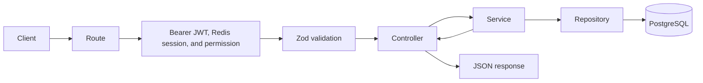

# Panduan Pengembangan Backend untuk Pemula

Dokumen ini menjelaskan cara memahami, menjalankan, dan mengembangkan Express Starter Kit ini. Panduan ditujukan untuk developer yang baru mengenal backend Node.js, Express, PostgreSQL, Redis, atau Prisma.

## 1. Gambaran Sederhana

Aplikasi ini adalah backend API. Backend menerima HTTP request dari frontend, aplikasi mobile, atau integrasi lain; memvalidasi input; menjalankan aturan bisnis; membaca atau menulis data; lalu mengirim JSON response.

Teknologi utamanya:

| Teknologi        | Fungsi                                                                   |
| ---------------- | ------------------------------------------------------------------------ |
| Node.js 22       | Menjalankan aplikasi JavaScript/TypeScript di server                     |
| TypeScript       | Memberikan type checking agar banyak kesalahan diketahui sebelum runtime |
| Express 5        | Menerima request HTTP dan mengatur route/middleware                      |
| PostgreSQL       | Menyimpan data utama secara permanen                                     |
| Prisma           | Mengakses PostgreSQL dan mengelola perubahan schema melalui migration    |
| Redis            | Menyimpan cache atau state sementara; bukan sumber data utama            |
| Zod              | Memvalidasi input dan environment variables                              |
| OpenAPI/Swagger  | Mendokumentasikan dan mencoba endpoint API                               |
| Pino             | Menulis structured log                                                   |
| Vitest/Supertest | Menjalankan unit test dan HTTP test                                      |

Contoh perjalanan request `POST /api/v1/users`:



Middleware keamanan yang relevan berjalan sebelum validasi dan controller. Setiap lapisan memiliki tanggung jawab berbeda. Jangan menaruh semua logika dalam route atau controller.

## 2. Hal Penting Sebelum Mulai

### Prasyarat

Pastikan tersedia:

- Node.js 22 LTS
- npm 10 atau lebih baru
- Git
- Docker dan Docker Compose untuk PostgreSQL dan Redis lokal
- Editor seperti Visual Studio Code

Periksa versi yang digunakan:

```bash
node --version
npm --version
docker --version
docker compose version
```

### Istilah dasar

- **Endpoint**: alamat API, misalnya `GET /api/v1/users`.
- **Request**: data yang dikirim client ke backend.
- **Response**: data yang dikirim backend ke client.
- **Middleware**: fungsi yang berjalan sebelum atau sesudah handler utama, misalnya validasi dan logging.
- **Schema**: definisi bentuk data yang valid.
- **Migration**: perubahan database yang tercatat dan dapat diterapkan secara berurutan.
- **Repository**: lapisan yang berbicara dengan database.
- **Service**: lapisan aturan bisnis/use case.
- **DTO**: bentuk data aman yang dikirim ke client.

## 3. Menjalankan Aplikasi Pertama Kali

### 3.1 Instal dependency

Untuk instalasi baru berdasarkan lockfile repository, gunakan:

```bash
npm ci
```

Gunakan `npm install` ketika memang menambah, menghapus, atau memperbarui dependency. Commit perubahan `package.json` dan `package-lock.json` bersamaan.

### 3.2 Buat konfigurasi lokal

Salin konfigurasi contoh:

```bash
cp .env.example .env
```

Kemudian periksa `.env`. Untuk development lokal, URL bawaan cocok dengan service pada `docker-compose.yml`. Ganti `JWT_ACCESS_SECRET` dan `JWT_REFRESH_SECRET` dengan string lokal yang berbeda dan panjangnya minimal 32 karakter.

Jangan pernah:

- commit `.env`;
- memasukkan password, token, atau secret asli ke source code;
- menulis secret ke log atau response API.

### 3.3 Jalankan PostgreSQL dan Redis

```bash
docker compose up -d postgres redis
```

Periksa statusnya:

```bash
docker compose ps
```

Data PostgreSQL dan Redis disimpan dalam Docker volume. Menghentikan container tidak otomatis menghapus data.

> **Peringatan database:** jangan menjalankan `prisma migrate reset`, `DROP`, `TRUNCATE`, menghapus volume, atau menimpa database dengan backup tanpa memverifikasi host/database/environment dan memperoleh persetujuan eksplisit. Anggap semua database berisi data penting.

### 3.4 Generate Prisma Client

```bash
npm run db:generate
```

Perintah ini menghasilkan client TypeScript di `src/generated/prisma`. Perintah ini tidak membuat tabel dan tidak menghapus data.

### 3.5 Terapkan migration development

Periksa terlebih dahulu nilai `DATABASE_URL` dalam `.env`. Pastikan benar-benar mengarah ke database development lokal yang dimaksud, kemudian jalankan:

```bash
npm run db:migrate
```

Untuk deployment, gunakan migration yang sudah di-commit melalui `npm run db:deploy`, bukan `db:migrate`.

### 3.6 Jalankan development server

```bash
npm run dev
```

Secara default:

- API: `http://localhost:3000`
- Swagger UI: `http://localhost:3000/docs`
- OpenAPI JSON: `http://localhost:3000/docs/openapi.json`
- Liveness: `http://localhost:3000/health/live`
- Readiness: `http://localhost:3000/health/ready`

Mode development melakukan restart otomatis ketika source code berubah.

## 4. Struktur Folder dan File

```text
.
├── .github/workflows/ci.yml        # Quality gate di GitHub Actions
├── docs/
│   └── development-guide.md        # Panduan ini
├── prisma/
│   ├── migrations/                 # Riwayat perubahan schema database
│   ├── schema.prisma               # Model dan mapping database
│   └── seed.ts                     # Entry point data awal
├── scripts/
│   ├── generate-openapi.ts         # Menghasilkan OpenAPI JSON statis
│   └── validate-openapi.ts         # Memvalidasi dokumen OpenAPI
├── src/
│   ├── app.ts                      # Komposisi Express, middleware, dan route
│   ├── server.ts                   # Bootstrap HTTP dan graceful shutdown
│   ├── config/                     # Validasi dan akses konfigurasi
│   ├── infrastructure/             # Database, Redis, logger, integrasi eksternal
│   ├── common/                     # Komponen bersama lintas modul
│   ├── docs/                       # Definisi OpenAPI dan Swagger runtime
│   ├── generated/                  # Prisma Client hasil generate
│   ├── modules/                    # Fitur bisnis, misalnya users
│   └── types/                      # Type augmentation global yang diperlukan
├── tests/
│   ├── e2e/                        # HTTP tests melalui Supertest
│   └── helpers/                    # Fake/test helper
├── .env.example                    # Daftar environment variable yang aman
├── docker-compose.yml              # PostgreSQL dan Redis untuk development
├── Dockerfile                      # Production container image
├── package.json                    # Dependency dan npm scripts
├── tsconfig.json                   # Konfigurasi TypeScript
└── vitest.config.ts                # Konfigurasi test
```

### Folder yang tidak diedit manual

- `node_modules/`: package hasil instalasi npm.
- `dist/`: JavaScript hasil `npm run build`.
- `src/generated/prisma/`: Prisma Client hasil `npm run db:generate`.
- `generated/openapi.json`: artefak hasil `npm run openapi:generate`.
- `coverage/`: laporan hasil test coverage.

Jika source berubah, edit file di `src`, `prisma`, `tests`, atau `scripts`, lalu generate/build ulang. Jangan memperbaiki masalah dengan mengedit `dist/server.js` atau file generated lainnya karena perubahan akan tertimpa.

## 5. Tanggung Jawab File Utama

### `src/app.ts`

Menyusun aplikasi Express tanpa membuka port jaringan. File ini:

- mengaktifkan request ID, logger, Helmet, CORS, JSON parser, dan rate limit;
- memasang Swagger dan health routes;
- memasang setiap feature router;
- memasang not-found dan centralized error handler;
- menerima dependency injection agar HTTP test tidak perlu database asli.

Urutan middleware penting. Error handler harus berada setelah route.

### `src/server.ts`

Menjalankan proses aplikasi sebenarnya. File ini:

- menghubungkan Redis;
- membuat HTTP server;
- mulai mendengarkan host/port;
- menangani `SIGINT` dan `SIGTERM`;
- menutup server, Prisma, dan Redis secara tertib.

Jangan import `server.ts` dalam test karena file tersebut langsung menjalankan server. Test harus memanggil `createApp()` dari `app.ts`.

### `src/config/`

`env.ts` mendefinisikan environment variable yang wajib dan memvalidasinya dengan Zod. `index.ts` memuat `.env` dan mengekspor konfigurasi bertipe.

Aturan:

- hanya folder ini yang membaca `process.env`;
- tambahkan variable baru ke schema dan `.env.example`;
- fail fast jika konfigurasi tidak valid;
- jangan memberikan default yang melemahkan keamanan production.

### `src/infrastructure/`

Berisi detail teknis yang digunakan fitur aplikasi:

- `database/prisma.ts`: Prisma client dan lifecycle PostgreSQL;
- `cache/redis.ts`: koneksi dan lifecycle Redis;
- `logger.ts`: Pino logger dan redaction data sensitif.

Integrasi pihak ketiga baru sebaiknya dibungkus sebagai adapter di folder ini, bukan dipanggil bebas dari controller.

### `src/common/`

Komponen bersama yang tidak dimiliki satu fitur tertentu:

- `contracts/`: schema response bersama;
- `errors/`: typed application error;
- `http/`: pembentuk response Laravel-compatible;
- `middleware/`: validasi, request ID, logging, rate limit, not-found, error handler;
- `openapi/`: konfigurasi Zod untuk OpenAPI;
- `utils/`: utility kecil seperti tanggal dan UUIDv7.

Jangan memindahkan logika bisnis khusus fitur ke `common` hanya agar dapat dipakai ulang. Abstraksikan setelah kebutuhan reuse benar-benar terlihat.

### `src/modules/`

Setiap fitur bisnis berada di folder sendiri. Modul `users` adalah contoh resource utama:

```text
src/modules/users/
├── user.route.ts        # URL, HTTP method, validation middleware
├── user.controller.ts   # Terjemahkan HTTP request/response
├── user.service.ts      # Use case dan aturan bisnis
├── user.repository.ts   # Query dan kontrak persistence
├── user.schema.ts       # Zod schema input/output
└── user.types.ts        # Record/DTO mapping yang diperlukan
```

Dependency mengalir satu arah:

```text
route → controller → service → repository → Prisma/PostgreSQL
```

Modul `auth` mengikuti alur yang sama dan menambahkan middleware Bearer JWT, validasi session Redis, serta rate limit khusus. Access dan refresh JWT dikembalikan dalam JSON; autentikasi tidak memakai cookie atau CSRF. Detail integrasi frontend, rotasi, replay detection, dan session lifecycle ada di [`authentication.md`](authentication.md).

Modul `authorization` memeriksa permission bernama secara exact melalui relasi database `users -> user_roles -> roles -> role_permissions -> routes`. Permission tidak disimpan dalam JWT sehingga pencabutan grant berlaku pada request berikutnya. Peta permission dan aturan RBAC lengkap ada di [`authorization.md`](authorization.md).

## 6. Cara Kerja Satu Request

Gunakan `POST /api/v1/users` sebagai contoh:

1. `app.ts` menerima request dan meneruskannya ke users router.
2. `user.route.ts` mencocokkan method/path, memverifikasi Bearer JWT, session Redis, dan permission exact `user.store`.
3. Validation middleware menjalankan `CreateUserSchema`; `user.schema.ts` menolak body yang salah atau field asing.
4. `user.controller.ts` mengambil input tervalidasi dari `response.locals.validated`.
5. `user.service.ts` melakukan use case, termasuk hash password dengan Argon2id dan membuat UUIDv7.
6. `user.repository.ts` menulis field yang memang diizinkan melalui Prisma.
7. `user.types.ts` mengubah database record menjadi DTO tanpa password hash.
8. Controller mengirim response standar melalui `sendSuccess`.
9. Error diteruskan ke centralized error handler dan dikirim melalui kontrak error standar.

Prinsip keamanan penting: request mentah tidak pernah langsung diberikan kepada Prisma.

## 7. Menambah Modul atau Fitur Baru

Misalnya ingin menambah resource `products`.

### Langkah 1: definisikan kebutuhan

Tentukan terlebih dahulu:

- endpoint dan HTTP method;
- input yang diterima;
- output yang boleh dilihat client;
- aturan bisnis;
- siapa yang boleh mengakses;
- perubahan database yang diperlukan;
- error yang mungkin terjadi;
- kebutuhan cache atau background job.

### Langkah 2: ubah model Prisma bila perlu

Tambahkan model/field/index/constraint di `prisma/schema.prisma`. Pastikan:

- nama tabel dan kolom database menggunakan `snake_case` melalui mapping;
- primary key entity menggunakan UUIDv7 dari aplikasi;
- foreign key, unique constraint, index, dan delete behavior eksplisit;
- timestamp dan soft delete ditambahkan sesuai kebutuhan.

Kemudian buat migration development hanya setelah memastikan target database:

```bash
npm run db:migrate
npm run db:generate
```

Review SQL baru di `prisma/migrations/`. Commit schema dan migration bersamaan.

### Langkah 3: buat schema Zod

Buat `product.schema.ts` untuk:

- path params;
- query params;
- request body;
- response DTO.

Gunakan `strictObject` untuk boundary object agar field asing tidak diteruskan diam-diam. Infer type dari Zod; hindari menduplikasi bentuk data sebagai interface manual.

### Langkah 4: buat repository

Buat kontrak `ProductRepository` dan implementasi Prisma bila query memang perlu diisolasi/reuse. Repository:

- hanya menangani persistence;
- memilih kolom yang diperlukan;
- tidak mengekspos data sensitif;
- selalu menerapkan filter soft delete bila digunakan;
- menggunakan pagination untuk list;
- menghindari query N+1.

### Langkah 5: buat service

Service menjalankan use case dan aturan bisnis. Letakkan di sini:

- pemeriksaan keberadaan data;
- authorization yang memerlukan data domain;
- transformasi aturan bisnis;
- transaksi multi-write;
- koordinasi repository/cache/integrasi.

Jangan melakukan network call lambat di dalam database transaction.

### Langkah 6: buat controller

Controller harus tipis:

- ambil input yang sudah tervalidasi;
- panggil satu operasi service;
- kirim status dan response yang benar.

Pesan API yang dilihat user menggunakan Bahasa Indonesia. Identifier, field, log, dan dokumentasi teknis tetap menggunakan Bahasa Inggris.

### Langkah 7: buat route

Route hanya mendeklarasikan:

- HTTP method;
- path;
- middleware authentication/authorization bila ada;
- validation schema;
- controller handler.

Semua public API menggunakan prefix `/api/v1` dan plural kebab-case nouns.

### Langkah 8: daftarkan module

Pasang router di `src/app.ts`. Jika module memiliki dependency, tambahkan ke `AppDependencies` agar dapat diganti fake pada test.

### Langkah 9: dokumentasikan OpenAPI

Tambahkan endpoint dan schema ke `src/docs/openapi.ts`. Dokumentasikan:

- summary, description, operation ID, dan tag;
- authentication/permission;
- path/query/header params;
- request body;
- semua response yang diharapkan;
- contoh request/response.

Runtime validation dan dokumentasi sebaiknya memakai Zod schema yang sama agar tidak drift.

### Langkah 10: tambahkan test

Minimal uji:

- happy path;
- input tidak valid;
- data tidak ditemukan;
- conflict/duplicate;
- unauthenticated dan unauthorized untuk endpoint terlindungi;
- dependency failure yang relevan;
- data sensitif tidak bocor.

Untuk HTTP test, gunakan `createApp()` dan fake repository seperti `tests/e2e/users.test.ts`. Jangan menggunakan database development atau production sebagai database test.

## 8. Database dan Prisma

### File penting

- `prisma/schema.prisma`: model deklaratif.
- `prisma/migrations/`: SQL migration yang menjadi riwayat schema.
- `prisma/seed.ts`: seed yang sebaiknya deterministik dan idempotent.
- `prisma.config.ts`: konfigurasi Prisma CLI.

### Perbedaan perintah

| Perintah              | Kapan digunakan                                                       |
| --------------------- | --------------------------------------------------------------------- |
| `npm run db:generate` | Setelah schema/dependency Prisma berubah; tidak memigrasikan database |
| `npm run db:migrate`  | Development: membuat dan menerapkan migration                         |
| `npm run db:deploy`   | Deployment: menerapkan migration yang sudah di-commit                 |
| `npm run db:seed`     | Mengisi data awal secara eksplisit                                    |

Jangan menggunakan schema synchronization atau reset otomatis saat aplikasi production mulai. Migration harus menjadi langkah deployment terpisah.

### Transaksi

Gunakan transaction jika beberapa write harus sukses atau gagal bersama. Contoh: membuat order dan mengurangi stok. Jaga transaction tetap singkat dan jangan mengirim email atau memanggil API pihak ketiga di dalamnya.

## 9. Redis

Redis cocok untuk:

- cache dengan TTL;
- rate limiting lintas instance;
- session atau token revocation;
- distributed coordination;
- queue metadata.

Redis bukan system of record. Data bisnis utama tetap disimpan di PostgreSQL.

Ketika menambah cache:

- prefix key dengan aplikasi, environment, dan domain;
- tentukan TTL;
- tentukan kapan key dihapus/diperbarui;
- tentukan apakah request fail open, fail closed, atau degraded saat Redis gagal;
- gunakan operasi atomic untuk perubahan yang sensitif terhadap concurrency;
- jangan gunakan `KEYS` pada request path production.

## 10. Response API dan Error

Jangan membuat bentuk response sendiri di setiap controller. Gunakan helper di `src/common/http/api-response.ts` agar kontrak tetap kompatibel dengan Laravel Starter Kit.

Success response berisi:

- `success: true`;
- `message`;
- `timestamp`;
- `total_data`;
- `data`;
- optional `pagination`;
- optional `debug` hanya di non-production.

Error response berisi:

- `success: false`;
- `message` yang aman;
- `timestamp`;
- optional `errors`;
- optional `debug` hanya di non-production.

Expected failure menggunakan `AppError` dengan HTTP status, stable error code, dan pesan aman. Jangan mengirim stack trace, query SQL, password hash, token, atau internal exception ke client.

## 11. Environment Variables

Semua variable didokumentasikan di `.env.example` dan divalidasi saat startup.

| Variable                         | Kegunaan                                      |
| -------------------------------- | --------------------------------------------- |
| `NODE_ENV`                       | Mode `development`, `test`, atau `production` |
| `APP_NAME`                       | Nama aplikasi/log context                     |
| `HOST`, `PORT`                   | Alamat listen HTTP                            |
| `TRUST_PROXY`                    | Kepercayaan terhadap reverse proxy            |
| `BODY_LIMIT_BYTES`               | Batas ukuran JSON/form request                |
| `HTTP_*_TIMEOUT_MS`              | Timeout request, header, dan keep-alive HTTP  |
| `SHUTDOWN_TIMEOUT_MS`            | Batas waktu graceful shutdown                 |
| `EXCEL_IMPORT_*`                 | Batas byte dan jumlah baris impor XLSX        |
| `EXCEL_EXPORT_BATCH_SIZE`        | Ukuran batch query export XLSX                |
| `FILE_STORAGE_PATH`              | Root penyimpanan binary lokal                 |
| `FILE_UPLOAD_MAX_BYTES`          | Batas ukuran satu upload                      |
| `FILE_ALLOWED_MIME_TYPES`        | Allowlist MIME berbasis signature             |
| `DATABASE_URL`                   | Koneksi PostgreSQL                            |
| `REDIS_URL`                      | Koneksi Redis                                 |
| `LOG_LEVEL`                      | Tingkat detail log                            |
| `CORS_ORIGINS`                   | Allowlist origin, dipisahkan koma             |
| `API_DOCS_ENABLED`               | Mengaktifkan docs di non-production           |
| `RATE_LIMIT_*`                   | Window dan batas request umum                 |
| `JWT_ACCESS_SECRET`              | Secret penandatangan access JWT               |
| `JWT_REFRESH_SECRET`             | Secret penandatangan refresh JWT              |
| `AUTH_JWT_*`                     | Issuer dan audience JWT                       |
| `AUTH_ACCESS_TTL_SECONDS`        | TTL access JWT                                |
| `AUTH_REFRESH_TOKEN_TTL_SECONDS` | Idle lifetime session dan refresh JWT         |
| `AUTH_*_RATE_LIMIT_*`            | Limit terpisah untuk login dan refresh        |

Perhatian:

- `TRUST_PROXY=true` hanya jika topologi proxy dipahami;
- production CORS harus berupa origin spesifik, bukan wildcard;
- refresh berhasil menerbitkan expiry baru dan memperpanjang TTL session Redis, sehingga user aktif tetap login;
- user yang tidak melakukan refresh sampai `AUTH_REFRESH_TOKEN_TTL_SECONDS` akan logout karena idle;
- secret access dan refresh JWT harus kuat, unik, dan berbeda;
- saat menambah variable, update `src/config/env.ts` dan `.env.example` dalam perubahan yang sama.

## 12. Excel Import/Export dan File Manager

### Excel user

Endpoint Excel berada di modul `users`:

- `GET /api/v1/users/import/template`: unduh template resmi;
- `POST /api/v1/users/import`: upload multipart dengan field `file`;
- `GET /api/v1/users/export`: stream XLSX tanpa password/hash.

Import mengikuti prinsip **validate first, write once**. Service memeriksa signature ZIP/XLSX, header persis, jumlah baris, setiap field, duplikat email di workbook, dan konflik email database. Jika satu baris salah, tidak ada pengguna yang dibuat. Error menunjuk nomor worksheet, misalnya `rows.2`. Password plaintext hanya dipakai untuk menghasilkan Argon2id hash dan tidak pernah disimpan atau diekspor.

Export memakai cursor pagination pada repository dan ExcelJS streaming writer. Jangan mengganti export menjadi satu query tanpa batas atau membangun seluruh workbook di memory.

### File manager

File manager memisahkan dua hal:

1. Metadata (`StoredFile`) di PostgreSQL: nama asli, MIME, extension, ukuran, checksum, dan storage key.
2. Binary melalui interface `FileStorage`. Default-nya `LocalFileStorage`; object storage dapat menggantinya tanpa mengubah controller/service.

Upload memakai memory hanya sampai `FILE_UPLOAD_MAX_BYTES`, lalu memeriksa signature dengan `file-type`, allowlist MIME, kecocokan extension, nama aman, key acak UUIDv7, dan SHA-256. Nama asli tidak pernah menjadi path penyimpanan. Download di-stream dan memakai metadata tepercaya untuk header.

Untuk local/container, mount `FILE_STORAGE_PATH` ke persistent volume. Untuk banyak replica, buat adapter S3-compatible yang mengimplementasikan `FileStorage`, lalu inject di `src/app.ts`. Endpoint file sudah memerlukan authentication dan permission RBAC yang sesuai; pertahankan middleware tersebut saat menambah operasi baru. Metadata soft-delete dan object deletion tidak dapat menjadi satu transaksi lintas PostgreSQL/object storage; production skala besar sebaiknya menambah retry/cleanup job untuk orphan object.

Schema `StoredFile` memiliki migration committed. Review target `DATABASE_URL` dan SQL migration, lalu terapkan melalui proses migration normal; aplikasi tidak menjalankannya otomatis.

## 13. Testing dan Quality Gate

### Test cepat

```bash
npm test
```

### Watch mode

```bash
npm run test:watch
```

### Coverage

```bash
npm run test:coverage
```

### Pemeriksaan lengkap

```bash
npm run validate
```

`validate` menjalankan:

1. Prettier check;
2. ESLint;
3. TypeScript typecheck;
4. seluruh test;
5. production build;
6. generate dan validasi OpenAPI.

Jalankan pemeriksaan paling kecil saat bekerja, lalu `npm run validate` sebelum pull request atau setelah perubahan luas.

### Keamanan database test

- Unit/HTTP test bawaan memakai fake dependency dan tidak terhubung ke PostgreSQL/Redis.
- Integration test harus memakai database dan Redis khusus test yang terisolasi.
- Jangan pernah menunjuk test ke development atau production database.
- Jangan mengandalkan `NODE_ENV=test` saja; verifikasi URL koneksi sebenarnya.

## 14. TypeScript dan Import

Project memakai native ESM dengan `NodeNext`. Relative import dalam source TypeScript menggunakan ekstensi `.js`, misalnya:

```ts
import { AppError } from '../../common/errors/app-error.js';
```

Ini disengaja. TypeScript akan mencocokkannya dengan file `.ts` saat development dan menghasilkan import yang benar saat build. Jangan menggantinya dengan `.ts` atau menghapus `.js` tanpa mengubah strategi module seluruh project.

Aturan utama:

- hindari `any`; gunakan `unknown` lalu narrow;
- hindari non-null assertion (`!`) dan cast yang tidak aman;
- gunakan named export;
- gunakan `async`/`await`;
- jangan meninggalkan Promise tanpa ditangani;
- file/folder `kebab-case`, variable/function `camelCase`, type/class/schema `PascalCase`.

## 15. Logging dan Debugging

Gunakan shared Pino logger, bukan `console.log`. Log harus terstruktur dan tidak mengandung data sensitif.

Setiap request memiliki `X-Request-Id`. Saat mencari masalah:

1. catat status code dan response;
2. ambil `X-Request-Id` dari response header;
3. cari request ID tersebut di log;
4. cek apakah `/health/ready` gagal pada PostgreSQL atau Redis;
5. cek konfigurasi tanpa mencetak secret;
6. buat regression test sebelum atau bersama perbaikan bug.

`/health/live` hanya menunjukkan proses hidup. `/health/ready` menunjukkan dependency yang dibutuhkan siap menerima traffic. Saat graceful shutdown dimulai, readiness langsung mengembalikan `503` agar load balancer berhenti mengirim request baru sebelum proses ditutup.

Request JSON/form yang melebihi `BODY_LIMIT_BYTES` ditolak dengan `413`, sedangkan JSON rusak menghasilkan `400` dalam response envelope standar. HTTP timeout pada `server.ts` membatasi koneksi lambat; sesuaikan nilainya dengan timeout reverse proxy/load balancer dan pastikan timeout infrastruktur berada di atas timeout aplikasi.

## 16. Build dan Production

Build lokal:

```bash
npm run build
npm start
```

`npm start` menjalankan hasil compile dari `dist`. Jangan menjalankan `npm start` sebelum build tersedia dan mutakhir.

Untuk container, `Dockerfile` memakai multi-stage build dan non-root runtime user. Pada deployment:

- gunakan environment variable dari secret manager/platform;
- jalankan `npm run db:deploy` sebagai langkah terpisah;
- jangan menjalankan migration bersamaan dari setiap replica;
- gunakan PostgreSQL/Redis managed atau private network;
- jangan publish port database/Redis ke internet;
- kirim structured logs ke log collector;
- gunakan Redis-backed rate limit jika aplikasi memiliki beberapa instance;
- lindungi atau nonaktifkan docs production;
- siapkan health checks dan graceful termination.

## 17. Kesalahan Umum

### Mengedit `dist/server.js`

`dist` adalah output build. Edit `src/server.ts`, kemudian jalankan `npm run build`.

### Prisma Client tidak ditemukan atau type tertinggal

Jalankan:

```bash
npm run db:generate
```

### Aplikasi gagal karena environment invalid

Baca daftar field pada error startup, bandingkan `.env` dengan `.env.example`, dan pastikan secret minimal 32 karakter.

### Readiness gagal

Pastikan PostgreSQL dan Redis hidup, URL/port benar, dan database tersedia:

```bash
docker compose ps
```

### Perubahan endpoint tidak muncul di Swagger

Update registrasi di `src/docs/openapi.ts`, kemudian jalankan:

```bash
npm run openapi:validate
```

### Test tanpa sengaja mengakses service asli

Pastikan test memanggil `createApp()` dengan fake dependency lengkap, bukan menjalankan/import `server.ts`.

### Error duplicate email

Uniqueness email dijaga oleh database. Error Prisma dipetakan secara terpusat. Jangan hanya melakukan pre-check tanpa unique constraint karena dapat mengalami race condition.

## 18. Checklist Sebelum Pull Request

- [ ] Perubahan fokus pada kebutuhan yang diminta.
- [ ] Semua input baru divalidasi dengan Zod.
- [ ] Endpoint terlindungi memiliki authentication dan authorization yang benar.
- [ ] Tidak ada secret, password hash, atau internal field pada response/log.
- [ ] Multi-write yang harus atomic memakai transaction.
- [ ] Cache memiliki TTL dan strategi invalidation.
- [ ] Perubahan database memiliki migration yang sudah direview.
- [ ] `.env.example` diperbarui jika konfigurasi berubah.
- [ ] OpenAPI diperbarui jika kontrak endpoint berubah.
- [ ] Test success dan failure path ditambahkan.
- [ ] `npm run validate` lulus.
- [ ] Tidak ada file generated, `.env`, log, atau artifact lokal yang tidak sengaja di-commit.
- [ ] Risiko, langkah deployment, dan migration requirement ditulis di pull request.

## 19. Urutan Belajar yang Disarankan

Untuk developer yang benar-benar baru, pelajari repository dalam urutan berikut:

1. Jalankan aplikasi dan buka Swagger UI.
2. Baca `src/app.ts` untuk melihat semua middleware dan route.
3. Ikuti alur `users` dari route sampai repository.
4. Baca `tests/e2e/users.test.ts` untuk memahami perilaku yang diharapkan.
5. Baca `prisma/schema.prisma` dan migration SQL.
6. Coba menambah field sederhana melalui schema, migration, DTO, OpenAPI, dan test.
7. Jalankan `npm run validate` dan perbaiki setiap kegagalan dari tahap paling awal.

Jika pola modul `users` diikuti secara konsisten, fitur baru akan lebih mudah diuji, didokumentasikan, dan dirawat.
